# 自定义建筑
## 手动建设建筑单位测试
**建筑也是单位的一种，此README注重于解决ability_id错误**

此步骤确保单位id的API设置修改成功

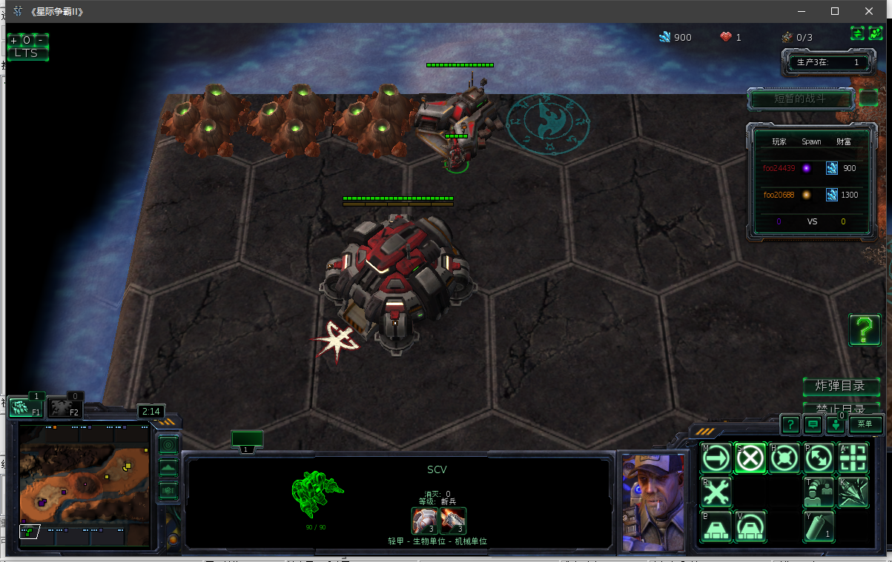

## 闪退跳出
### 原因一：**注意地图编辑器button和单位名字要对应**

（默认对战建筑的名称无法更改）
### 原因二：单位id非法

见自定义单位章节

## 例子1
### 代码

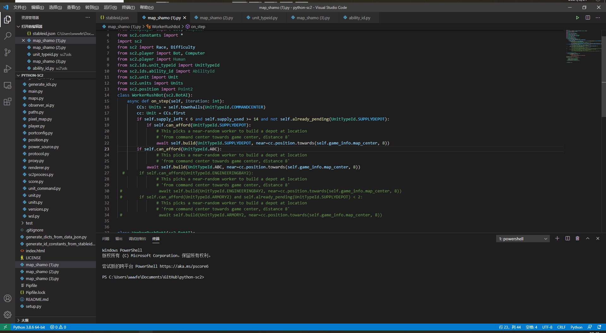

### 运行效果

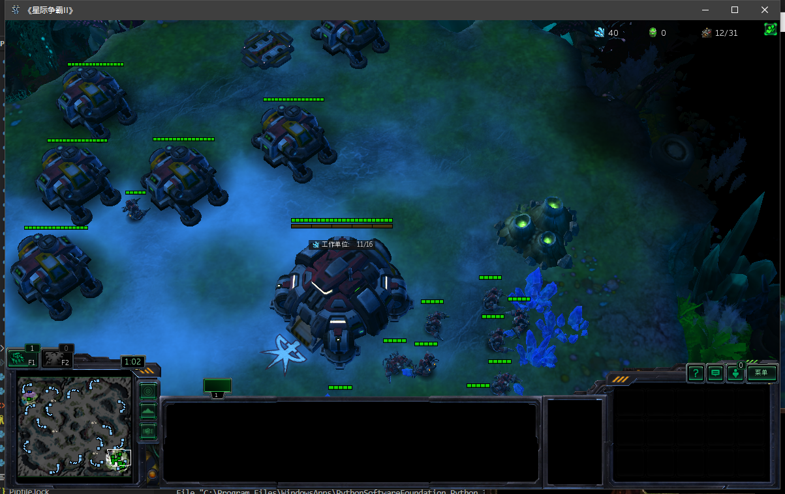

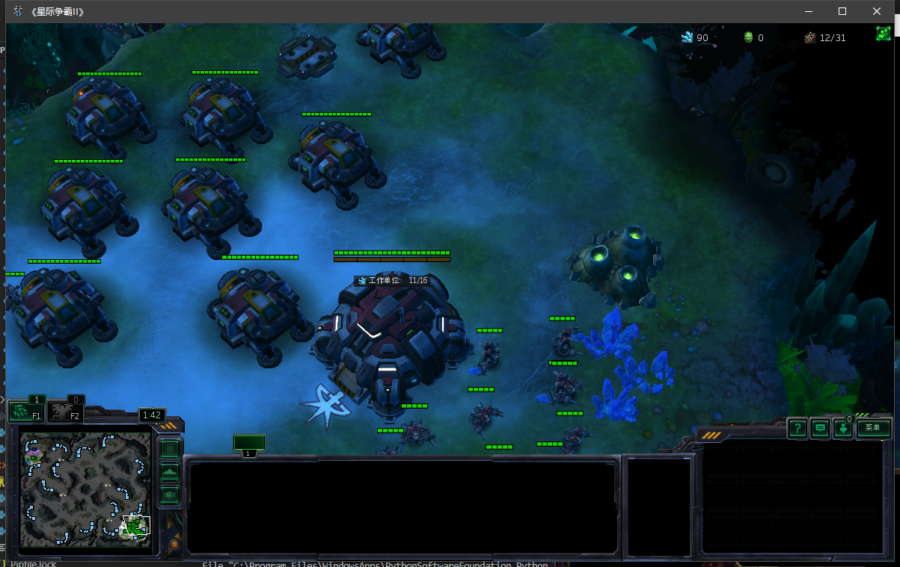

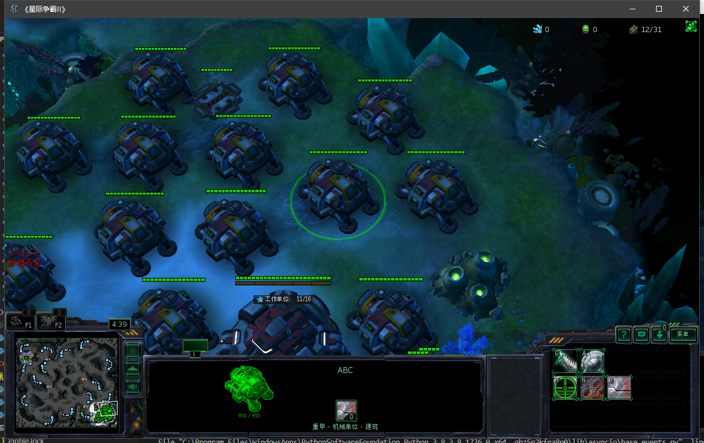

### API设置（初级）

### 修改单位id

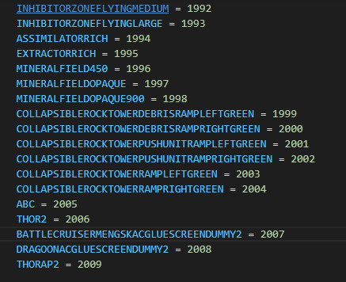
### 修改特性id
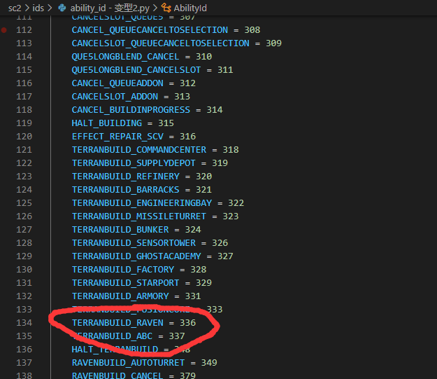

注意这里的id序号中间有很大空缺是因为SCV的建造最大数量时20，id排序提前退出了。很多人在最后接着最后id仿写id序号时没有用的，需要找到空缺的id填充上名称和编号。

## 例子2
### 代码

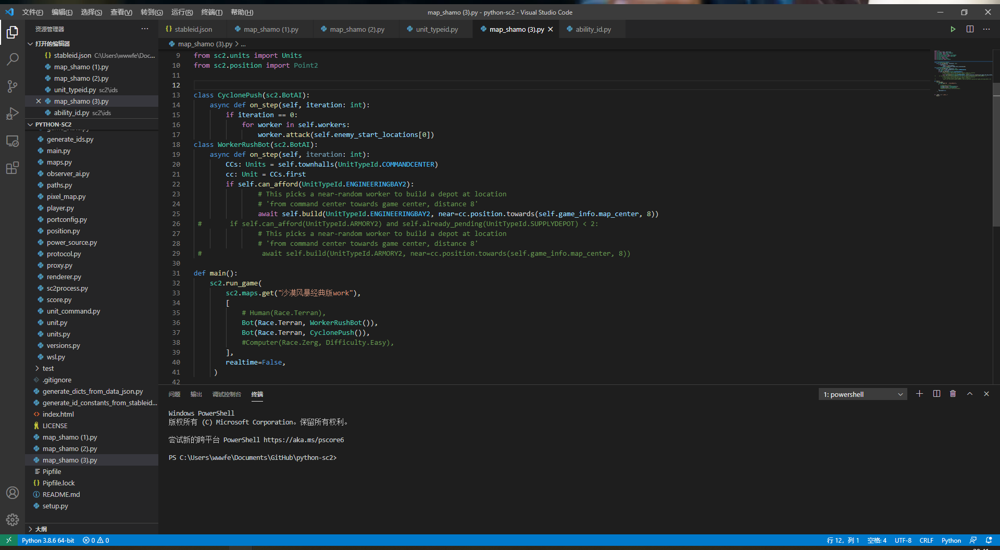

### 运行效果

<video src="《星际争霸II》 2021-03-21 01-16-18.mp4"></video>

### API设置（高级）
先休息，作业太多了

# 报错汇总

## 地图测试时，复制单位创建的自定义单位报错
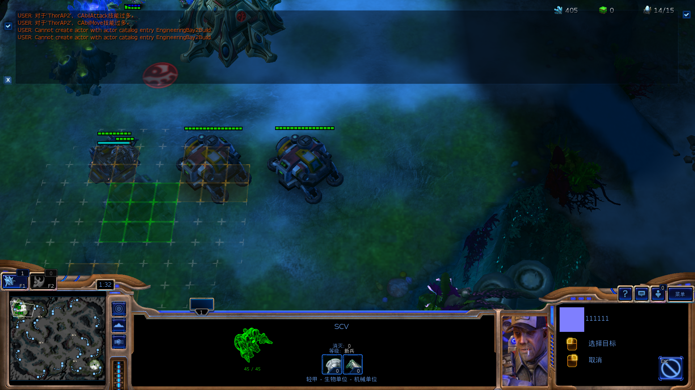

这个不重要。小问题，没有建造动画。可以建造就不会跳出。
## SCV拒绝建造铁牙（建筑）
拒绝执行，检查是不是0.12版本，那个库停止维护了

## web_socket传输错误

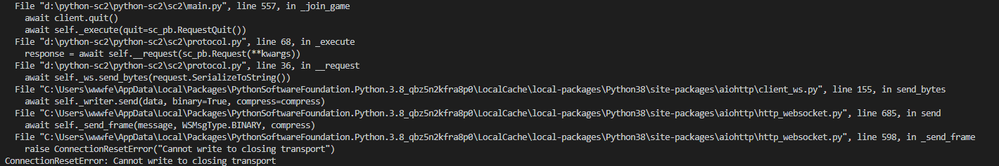

这是代码写的不规范的问题，同时建造3个补给站时候报错。

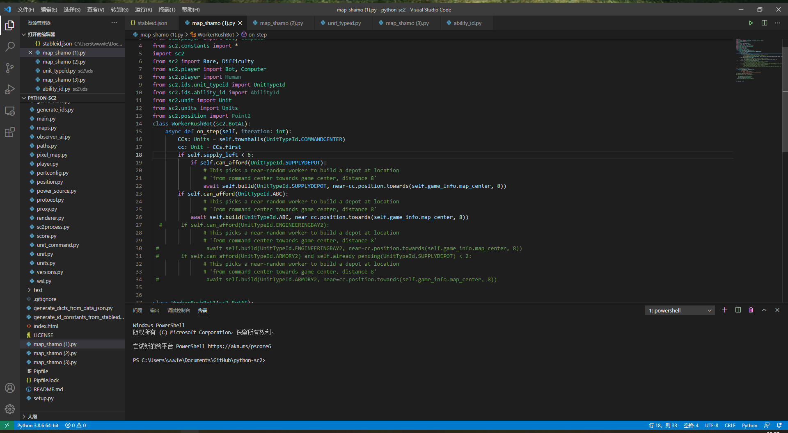

应当加以限制，就可以正常运行。

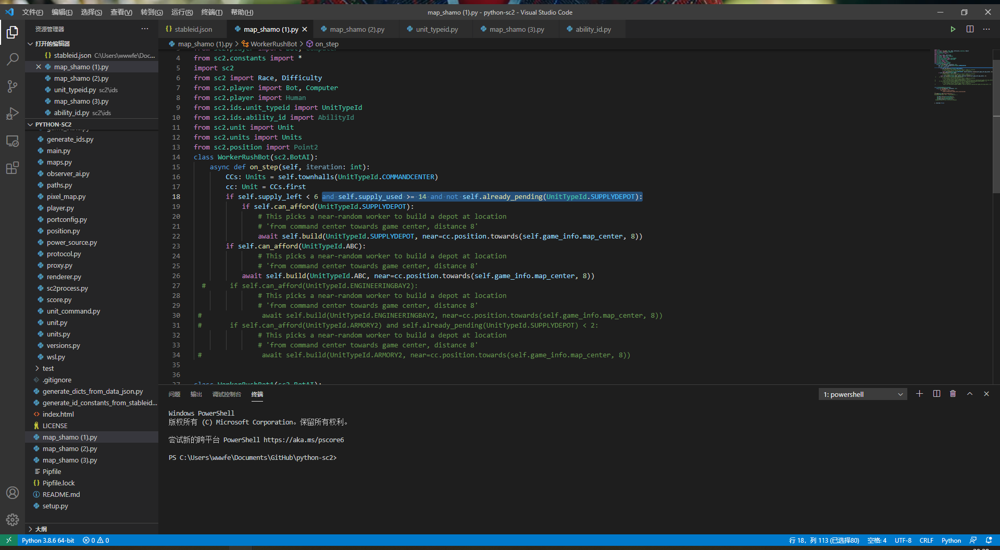

## 非法的单位名称building

## 非法的单位id2005
这是因为游戏API会随机分配地图中每种单位一个id。API程序python-sc2会查询unit_typeid.py中的单位id。如果id不够，那么报错跳出。此时随便起个名字就能通过，程序会自动分配id，所以还是参照单位地图中名称命名。

但是这个名字不利于接下来的调用，所以会出现下面的报错。
## ability_id错误 AtributeError(name) from None

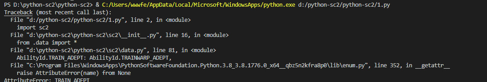

SCV在调用建筑时候没有相应的能力id在ability_id.py文件中。

## generate_id_constants_from_stableid.py

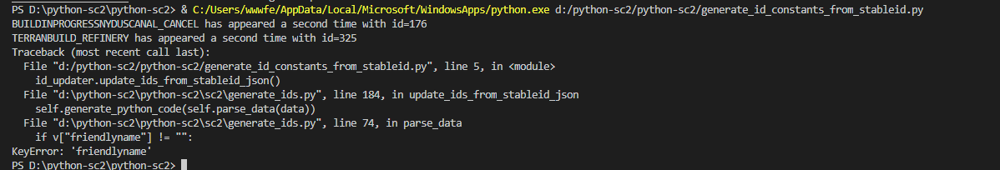

先休息