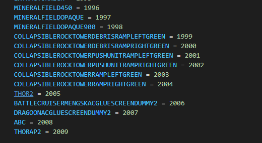
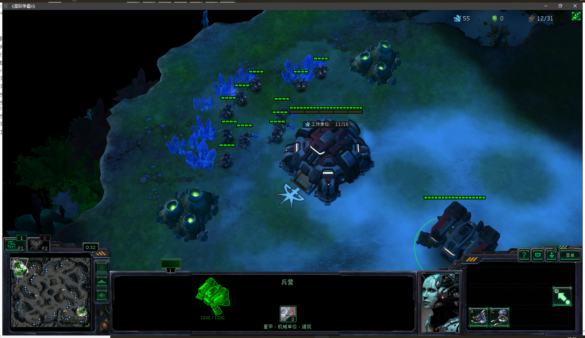
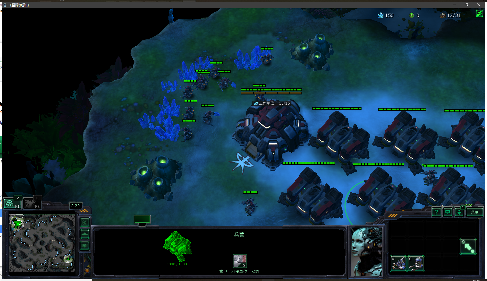
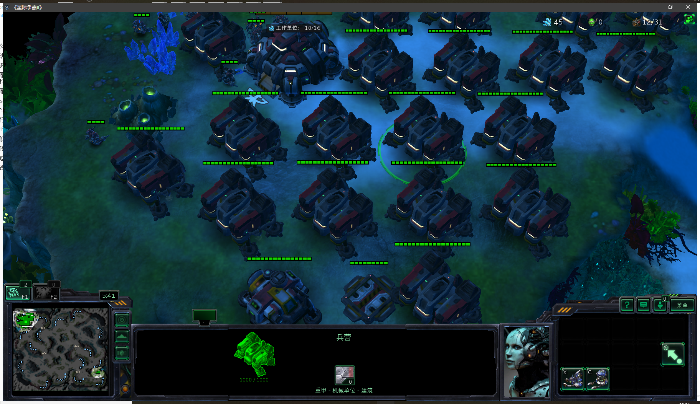

# 自定义建筑
## 手动建设建筑单位测试
**建筑也是单位的一种，此README注重于解决ability_id错误**

此步骤确保单位id的API设置修改成功

## 闪退跳出
### 原因一：**注意地图编辑器button和单位名字要对应**

（默认对战建筑的名称无法更改）
### 原因二：单位id非法

见自定义单位章节

# AbyssalReefLE对战地图
## 代码

## 运行效果

## API设置（初级）

高级API设置参见custom building1。

### 修改单位id

### 修改特性id

注意这里的id序号中间有很大空缺是因为SCV的建造最大数量时20，id排序提前退出了。很多人在最后接着最后id仿写id序号时没有用的，需要找到空缺的id填充上名称和编号。

## 问题

始终无法制造铁牙，多次修改铁牙各种属性为建筑。尚且不知道什么条件下，SCV可以建造铁牙。

这个问题在之后的沙漠风暴原版地图中依然存在SCV无法建造建造中存在。

而且复制的雷神2在建造时候价格始终使用雷神1价格，应该引用错误。

是因为使用了制造雷神按钮，而这个按钮有重复在重工厂，所以覆盖掉了后面的能力。

## 修改使用ABC按钮建造兵营
修改使用ABC按钮建造兵营。原本兵营建造能力注释掉，dicts里面相关API代码注释。兵营删除士兵的按钮GUI，模拟沙漠风暴中被修改的兵营建筑单位。

之前使用补给站测试过修改可用性，建造时间，建造花费。