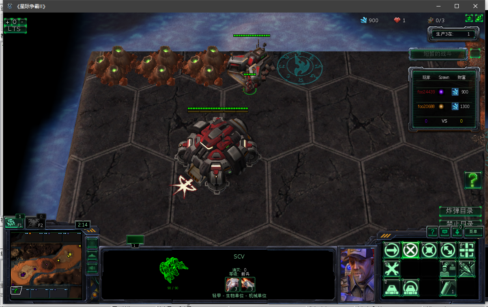
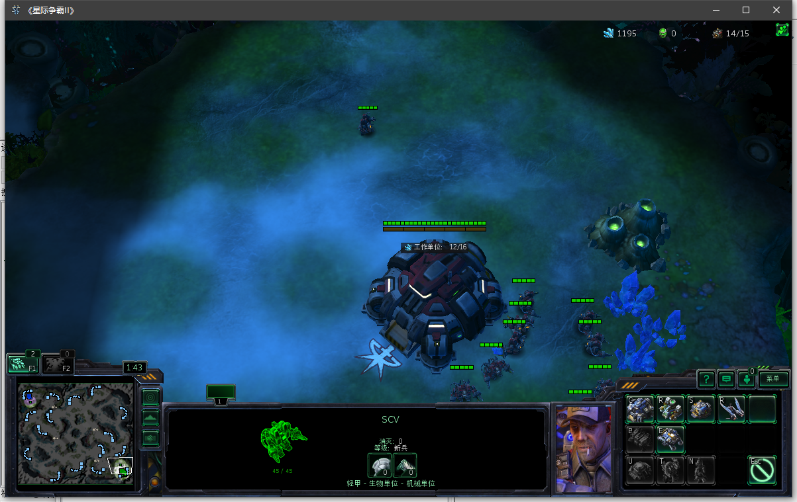
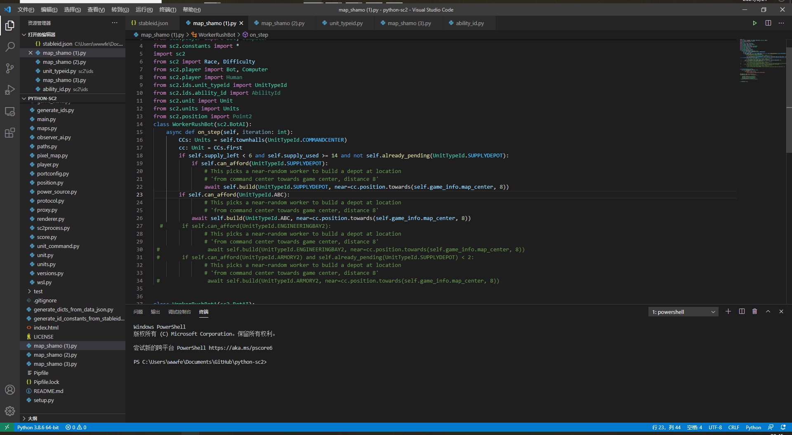
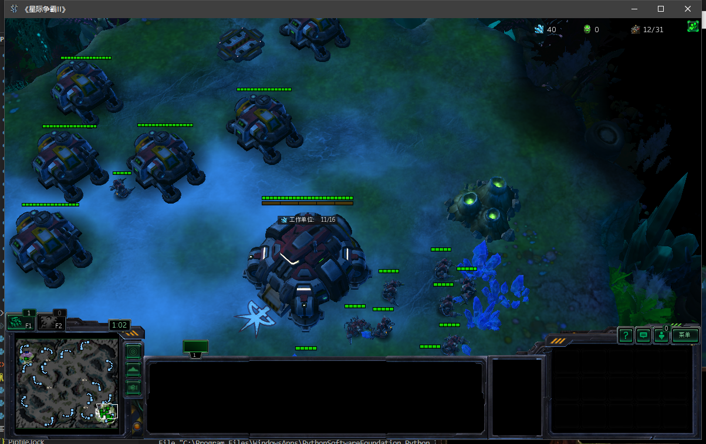
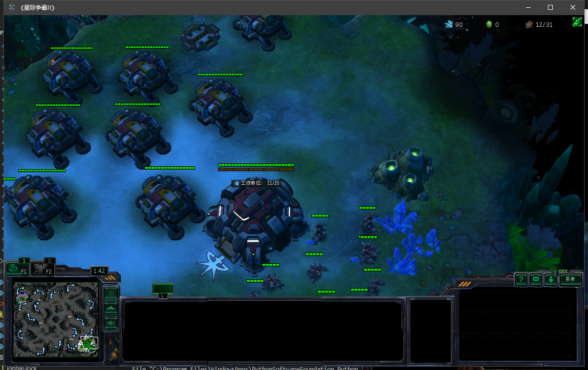
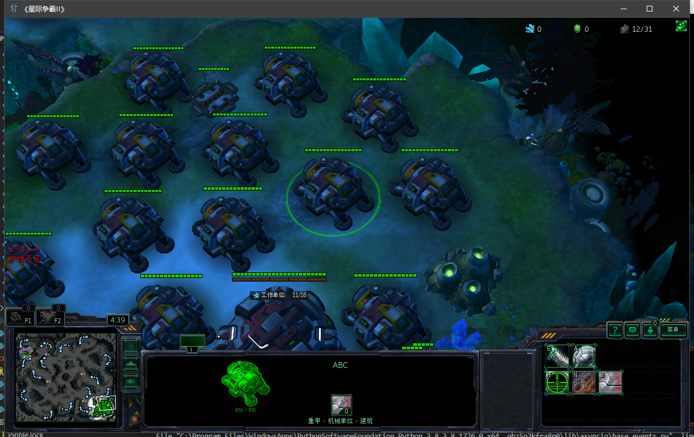
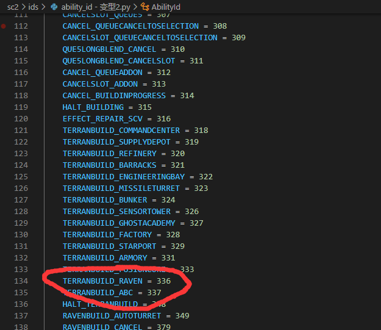

# 自定义建筑
## 手动建设建筑单位测试
**建筑也是单位的一种，此README注重于解决ability_id错误**

此步骤确保单位id的API设置修改成功

## 闪退跳出
### 原因一：**注意地图编辑器button和单位名字要对应**

（默认对战建筑的名称无法更改）
### 原因二：单位id非法

见自定义单位章节

## 例子1
### 代码

### 运行效果

### API设置（初级）

高级API设置参见custom building1。

### 修改特性id

注意这里的id序号中间有很大空缺是因为SCV的建造最大数量时20，id排序提前退出了。很多人在最后接着最后id仿写id序号时没有用的，需要找到空缺的id填充上名称和编号。

