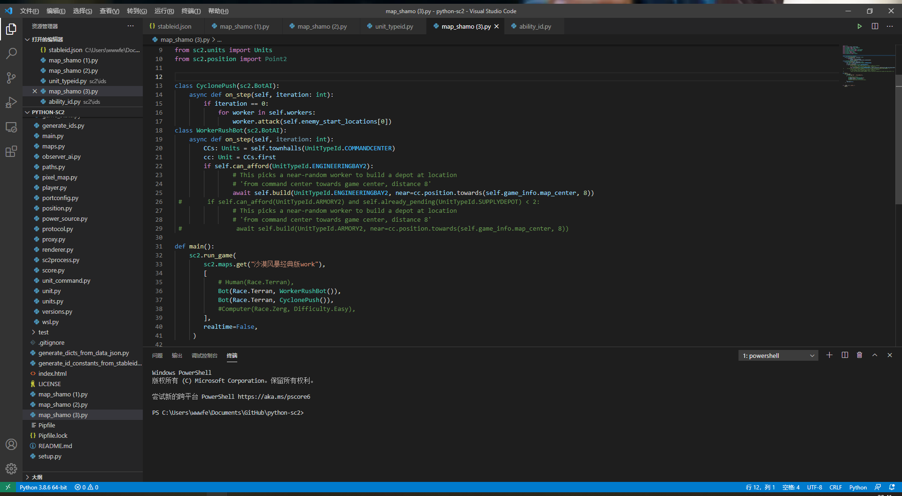
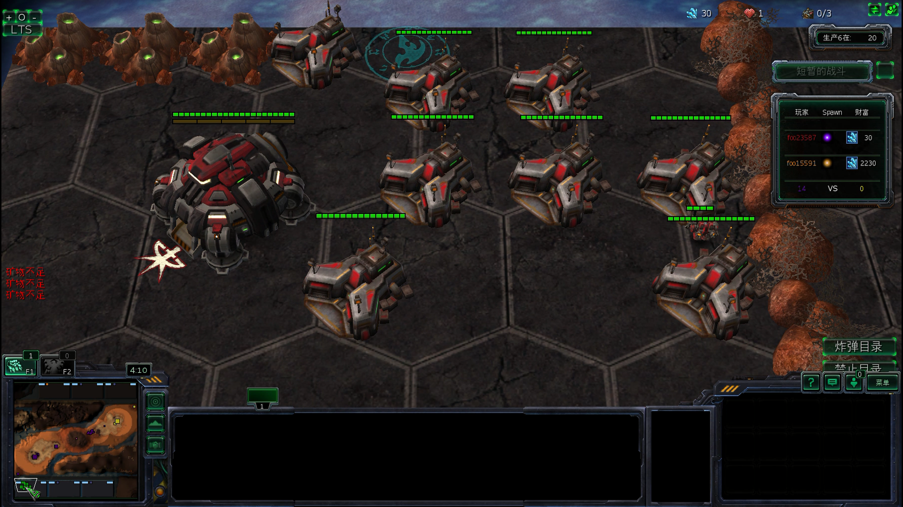
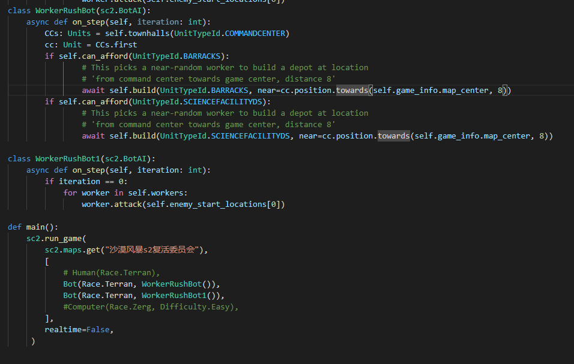
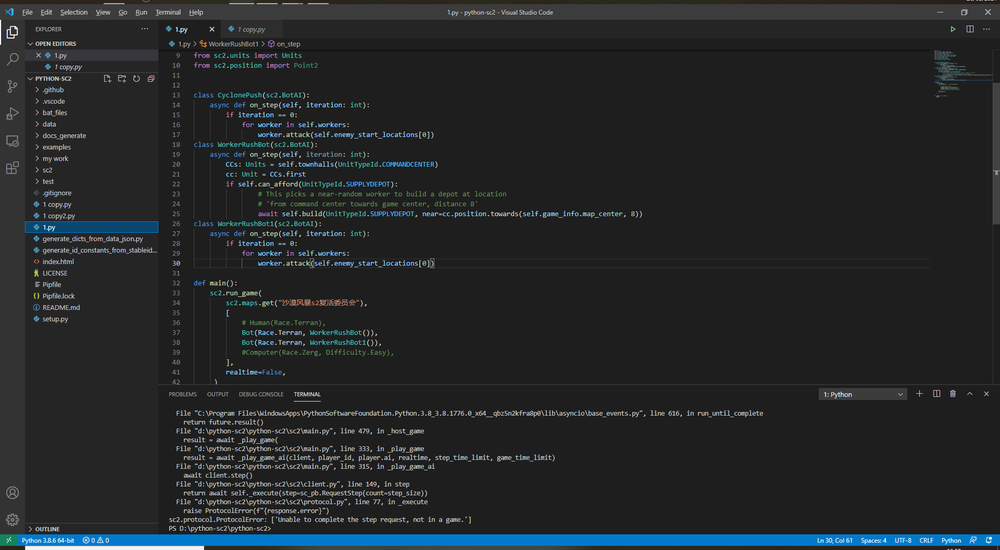
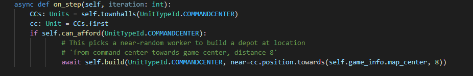

# 沙漠风暴原版

## 代码

## 运行效果

https://m.bilibili.com/space/22443768

或者下载目录下视频文件
## 问题
无法建造兵营补给站这些非自定义而是修改后的建筑，虽然可以建造自定义单位。这是一件非常奇特的事情。
## API设置（高级）
先休息，作业太多了

# 沙漠风暴S2混沌风暴
这个图是玩家对战AI的boss战地图

API无法建造兵营、补给站这些非自定义而是修改后的建筑，也无法建筑自定义建筑。

代码在AbyssalReefLE2上面依然有效。

# 沙漠风暴S2复活委员会
API无法建造兵营、补给站这些非自定义而是修改后的建筑。

在手动建造完这些科技前置建筑后，SCV会自动建造后面的自定义建筑。

相同代码在AbyssalReefLE2上面依然有效。

# 沙漠风暴S3&&S4
因为GUI选取种族问题，必须选取后才能出现指挥中心和工人，所以会出现报错，unit为空。因为需要使用unit得到指挥中心的位置，为工人建筑其他单位提供position参数。

而且这是游戏大厅正在游玩和更新的游戏，感觉使用它用来搞强化学习对原作者有些冒犯。团队负责人老冰一直不回复消息，也联系不到。当然现在也没成功用API跑起来这张地图，没有什么实际工作成果。

也致敬S2的阿塔尼斯和S3的蒙斯克。

# 未来工作
1. 需要反向从比赛对战地图一点点修改看是否能够建筑建筑。

2. 从源码一点点反向测试，看源码每个部分功能。
	
	常量中有很多单位和升级的限制，但是去掉了工人也能建筑，这一点很奇怪。
	
3. 我得歇一歇，先搞完雅思和毕业设计了。