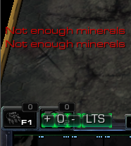
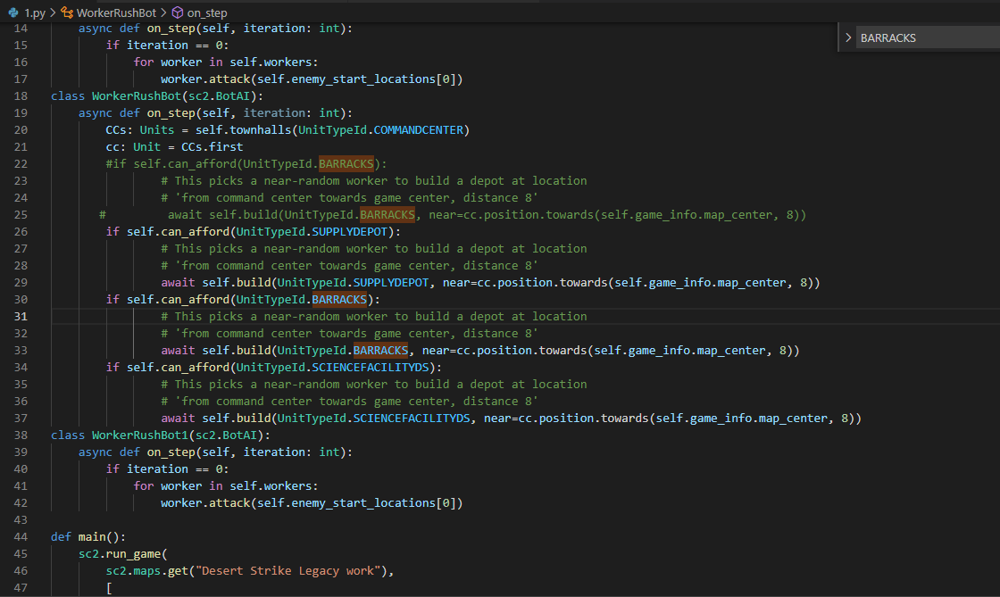

# 沙漠风暴原版

## 代码

## 运行效果

https://www.bilibili.com/video/BV1eX4y137A7

或者下载目录下视频文件。
## 问题
无法建造兵营补给站这些非自定义而是修改后的建筑，虽然可以建造自定义单位。这是一件非常奇特的事情。

打开地图什么不修改，保存，原本的159MB文件会变为1.77MB。

修改任何单位会发现警告无法加载GUI和xml相关错误。后面《沙漠风暴S2复活委员会》同样问题，并且有图片。但这个不影响API操控单位。

沙漠风暴原版最初是2010年作品。在2017的对战比赛地图AbyssalReefLE中的测试，完全没有问题，在老地图可能会出现这些问题吧。新的拉锯战地图沙漠风暴S3，S4可能会成功。但我想等到以后再尝试一下吧。

## API设置（高级）
游戏每载入一次地图，C:\Users\wwwfe\Documents\StarCraft II目录下的stableid.json会更新一次。此时使用generate_id_constants_from_stableid.py更新ids下unit_typeid.py和ability_id.py和upgrade_id.py。

此时会有报错friendly_names是空。这是因为给ability实体类命名的时候，stable.json中单位buttonname和friendlyname都为空了（老地图不规范）。此时修改之，能命名就好，其他的事情以后再对付。

这个github存储库的组织中的python-sc2是我Forked并修改的，里面有修改号的generate_ids_bug_friendlyname.py文件和generate_id_constants_from_stableid - bug - friendlyname.py文件。

但是此时会缺失dicts的绑定的单位属性，此时有两种做法。推荐方法二。

方法一：使用文件对比归并在线工具，把API原版的文件和新生成的文件对比归并成一个新文件。

https://www.diffchecker.com/diff

方法二：把dicts中缺失的部分注释掉，或者删除掉。尚且未知删除后果，应该是选取单位后使用能力和升级科技的实体类。不过这并不影响SCV建造，也就是不影响沙漠风暴强化学习这个工程。

# 沙漠风暴S2混沌风暴
这个图是玩家对战AI的boss战地图。

API无法建造兵营、补给站这些非自定义而是修改后的建筑，也无法建筑自定义建筑。

代码在AbyssalReefLE2上面依然有效。

# 沙漠风暴S2复活委员会
API无法建造兵营、补给站这些非自定义而是修改后的建筑。

在手动建造完这些科技前置建筑后，SCV会自动建造后面的自定义建筑。

相同代码在AbyssalReefLE2上面依然有效。

它的科技馆名称并没有对应button按钮名称，也能使用UnitTypeId.SCIENCEFACILITY激活SCV建造能力TERRANBUILD_MERCCOMPOUND = 337。

然而普通更换按钮和能力会跳出能力错误AssertionError: C: None，用generate_id_constants_from_stableid.py文件重新生成才可以。

之前custom1中ABC建筑仅仅更改unit_typeid.py和ability_id.py文件即可。

对比文件我们发现ability_id.py没有变化，但是unit_typeid.py变化如下。

## 修改兵营可用性

从抑制变为可用，依然没用。依然是手动建造完修改的兵营后，才能API自动使用SCV建造自定义单位（if语句）。

GUI混乱，似乎因为图太老，导致xml解析无法读取到资源。

## 修改兵营按钮对应科技馆（医疗兵）

兵营GUI按钮不见了。依然没用

## 修改补给站可用性

依然没用。

# 沙漠风暴S3&&S4

因为GUI选取种族问题，必须选取后才能出现指挥中心和工人，所以会出现报错，unit为空。因为需要使用unit得到指挥中心的位置，为工人建筑其他单位提供position参数。

而且这是游戏大厅正在游玩和更新的游戏，感觉使用它用来搞强化学习对原作者有些冒犯。团队负责人老冰一直不回复消息，也联系不到。当然现在也没成功用API跑起来这张地图，没有什么实际工作成果。

也致敬S2的阿塔尼斯和S3的蒙斯克。

# Desert Strike Legacy
这个似乎沙漠风暴的美服加强版，大概和s2复活委员会水平差不多，最后更新日期是2019年。

依然无法建造修改的已有对战建筑，手动建造前置后API才操控SCV执行建造代码（if语句），而之前的建造补给站代码没有执行（if语句）。

## 细节

F1反复刷新，说明代码在运行，就是建造不了兵营。

手动建造兵营后，激活API的建造科技馆（医疗兵）代码（if语句）。

## 修改兵营可用性
依然没用。但是没有GUI混乱，虽然也报错了。

吐槽一局，老外代码真是漂亮。

国内软件工程和开发环境实在是太学校教师权威和跨界管理了，导致新程序员软件工程方面缺乏训练和指导，996导致程序员也没法有时间贡献社区，从而培养下一代程序员了。

游戏社区mod制作者主力往往是半路出家的游戏爱好者，缺乏专业训练和维护持续性，缺乏编写工具自动化开发mod的能力。

但是热情真的很重要，手动改几千个地图块的猛人！也有很多人离开了我们。如果能大规模使用工具自动化，那么也许梦想就不会这么累。

很少有计算机和软件工程毕业的程序员。估计都在996吧。

## 交换补给站和科技馆（医疗兵）

API建造了科技馆(医疗兵)。按钮是补给站。

这说明是对战建筑的问题。就像API无法建造铁牙和雷神一样。

**重要提示：**

需要重新使用generate_id_constants_from_stableid.py构造一下ids下的unit_typeid.py和ability_id.py文件。因为ability已经改变，而unit的id也随之有些变化。

## 还原补给站单位xml和模型xml

还原补给站单位xml，但还是模型显示过大。依然没用。

还原模型xml后。依然没用。

这里有一个细节Not enough minerals，一直出现到4500矿的时候才消失。

查询xml文件中发现TerranBuild3中有mineral value=4500。然而对战地图AbyssalReefLE中不含TerranBuild2和TerranBuild3。删除之。

应该是自动调用了最后一个TerranBuild3中的矿物和建造ability，但是建筑ability在TerranBuild中，而不在TerranBuild2和TerranBuild3中。

可以发现如果没有空余空间了，SCV会建设可以建设的建筑补给站。

## 运行效果

https://www.bilibili.com/video/BV1954y1877w

功夫不负有心人。耗时4.5周。经历2年时间，终于成功了。

# 未来工作【废弃】
1. 需要反向从比赛对战地图一点点修改看是否能够建筑建筑。

   

2. 从源码一点点反向测试，看源码每个部分功能。

  

  常量中有很多单位和升级的限制，但是去掉了工人也能建筑，这一点很奇怪。

  

3. 我得歇一歇，先搞完雅思和毕业设计了。

   

4. 个人认为老地图的问题，新地图应该没有问题。毕竟从自由之翼到群虫之心，再到虚空之遗变了很多了。