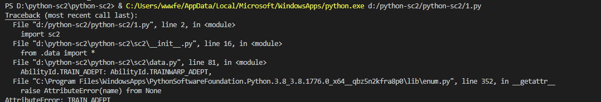

# 测试地图
- 一些地图可以成功一些地图不可以成功
- 队伍设置需要改动一下地图中的阵营

- 战役地图应该全部可以使用
因为C:\Users\wwwfe\Documents\StarCraft II中的stableid.json的是python-sc2中unit_typeid.py和ability_id.py的来源，包含core（无单位）以及自由之翼，群虫之心，虚空之遗三个战役包的全部内容。

例如：钥匙卡牌会出现自己出的兵直接攻击自己的基地情况

# 重要提示

盗图狗是社区人人喊打的存在。禁止二次发布，并声称自己是作者。
本GitHub项目仅仅是帮助那些致力于starcraft2强化学习ai研究的玩家。仅仅用于离线使用地图训练ai。
请遵守游戏公德

# 重返艾尔

# 报错汇总
## 非法的单位id2005
这是因为游戏API会随机分配地图中每种单位一个id。API程序python-sc2会查询unit_typeid.py中的单位id。如果id不够，那么报错跳出。此时随便起个名字就能通过，程序会自动分配id，所以还是参照单位地图中名称命名。

## ability_id错误 AtributeError(name) from None

SCV在调用建筑时候没有相应的能力id在ability_id.py文件中。