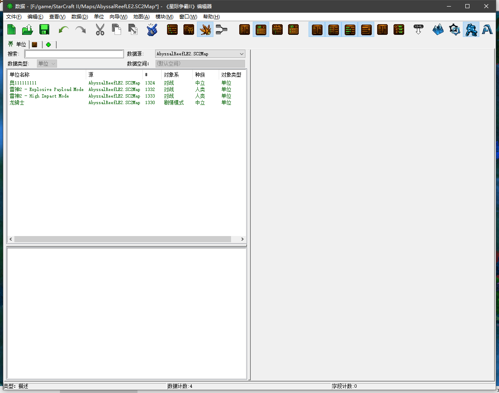
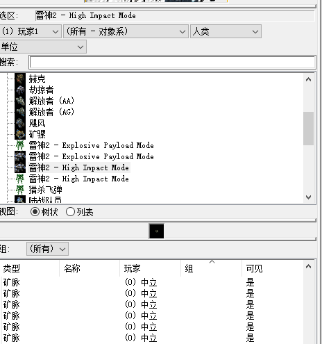
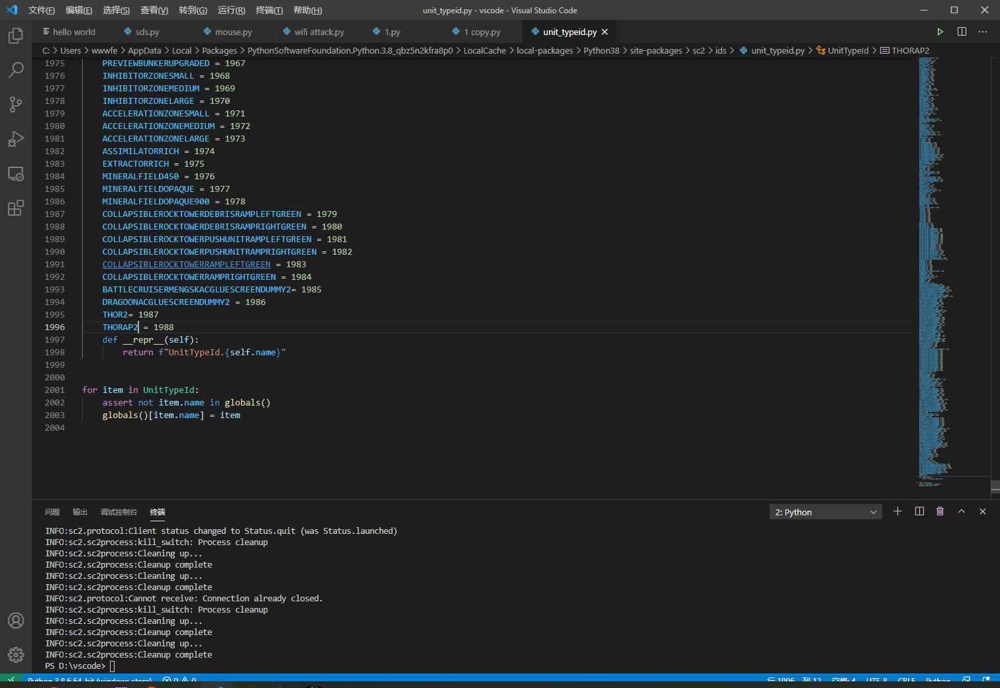
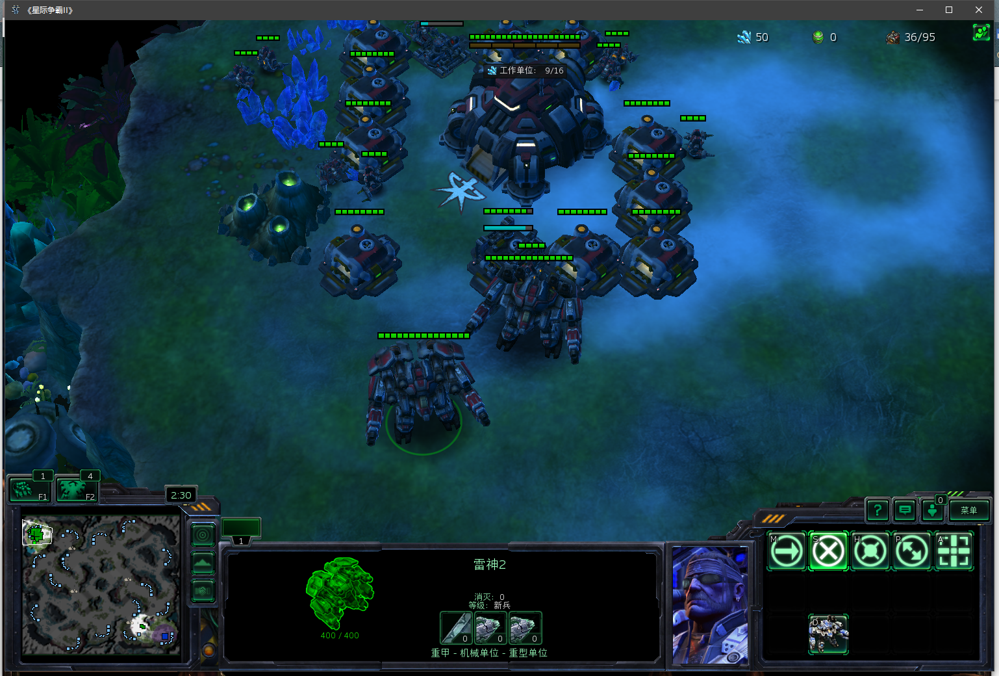
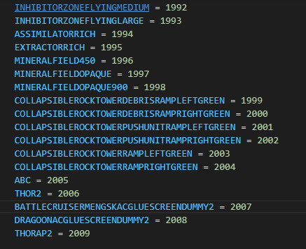

# 自定义单位
## 地图设置

## API设置

## 代码

## 运行效果

# 报错汇总
## 非法的单位id2005
这是因为游戏API会随机分配地图中每种单位一个id。API程序python-sc2会查询unit_typeid.py中的单位id。如果id不够，那么报错跳出。此时随便起个名字就能通过，程序会自动分配id，所以还是参照单位地图中名称命名。

但是这个名字不利于接下来的调用，所以会出现下面的报错。

## 非法的单位名称building

主程序调用的程序在unit_typeid.py中没有查找到。