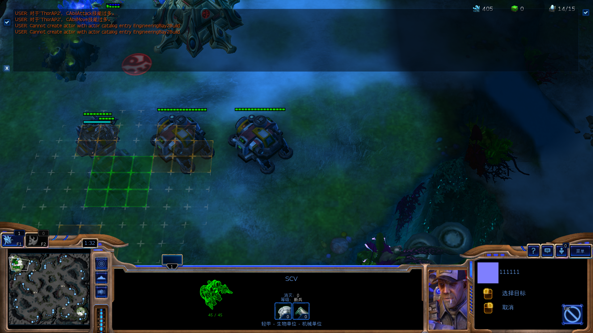
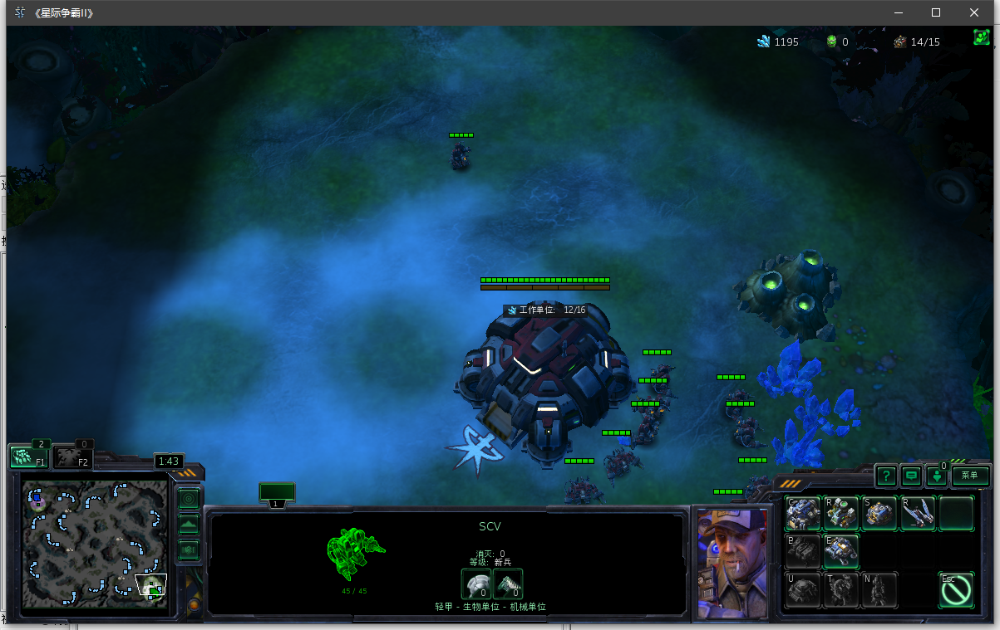
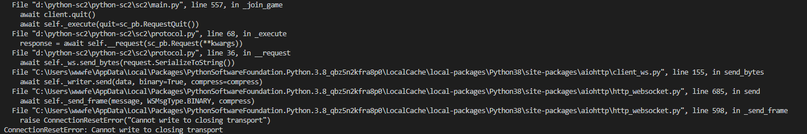
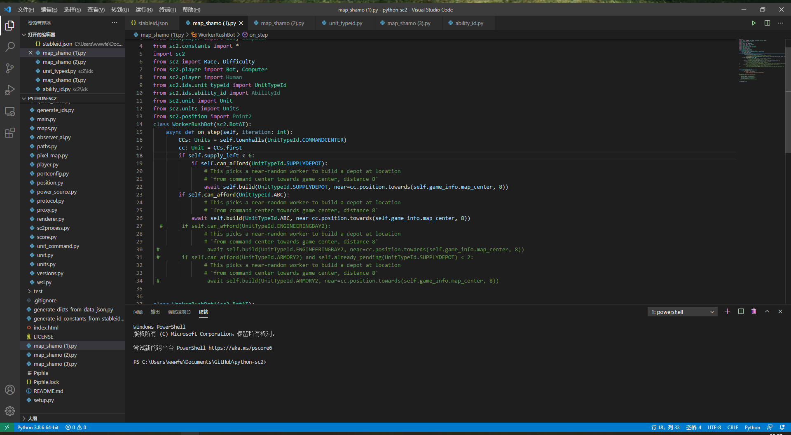
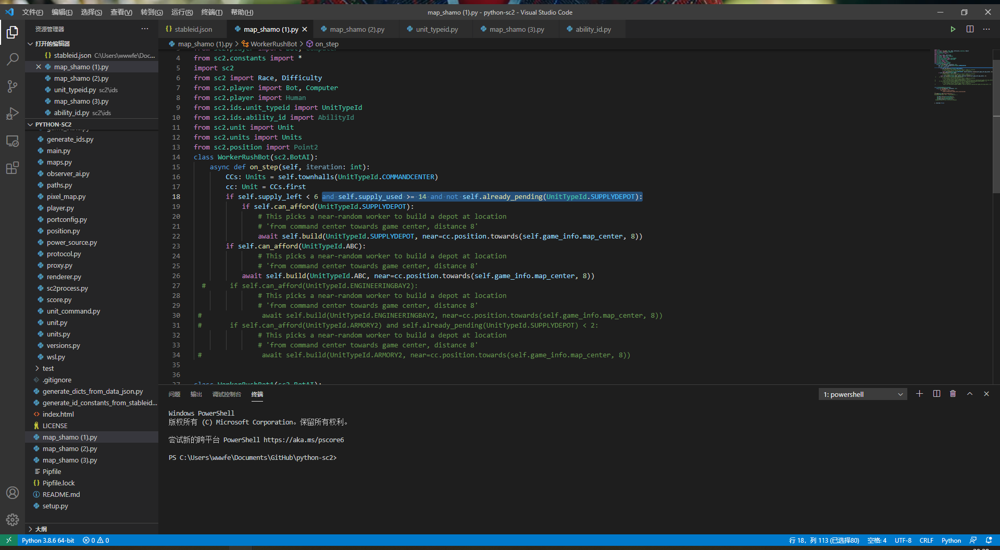
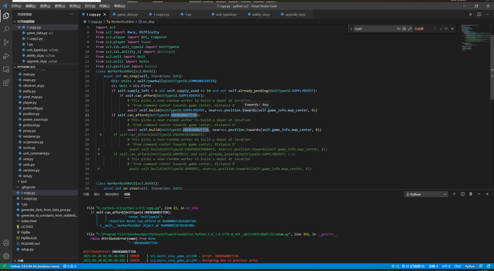
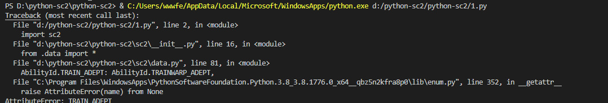
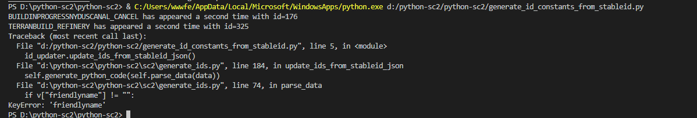

# 报错汇总

## 地图测试时，复制单位创建的自定义单位报错

这个不重要。小问题，没有建造动画。可以建造就不会跳出。
## SCV拒绝建造铁牙（建筑）
拒绝自动执行建造铁牙，检查是不是0.12版本，那个库停止维护了

## web_socket传输错误

这是代码写的不规范的问题，同时建造3个补给站时候报错。

应当加以限制，就可以正常运行。

## 非法的单位id2005
这是因为游戏API会随机分配地图中每种单位一个id。API程序python-sc2会查询unit_typeid.py中的单位id。如果id不够，那么报错跳出。此时随便起个名字就能通过，程序会自动分配id，所以还是参照单位地图中名称命名。

但是这个名字不利于接下来的调用，所以会出现下面的报错。

## 非法的单位名称building

## ability_id错误 AtributeError(name) from None

SCV在调用建筑时候没有相应的能力id在ability_id.py文件中。

## generate_id_constants_from_stableid.py

先休息

# unit=空，跳出

地图上没有这个单位。

原因一：id_version.py文件里面没有对应的名称

原因二：有选择种族的GUI，之后才刷出指挥中心和种族工人